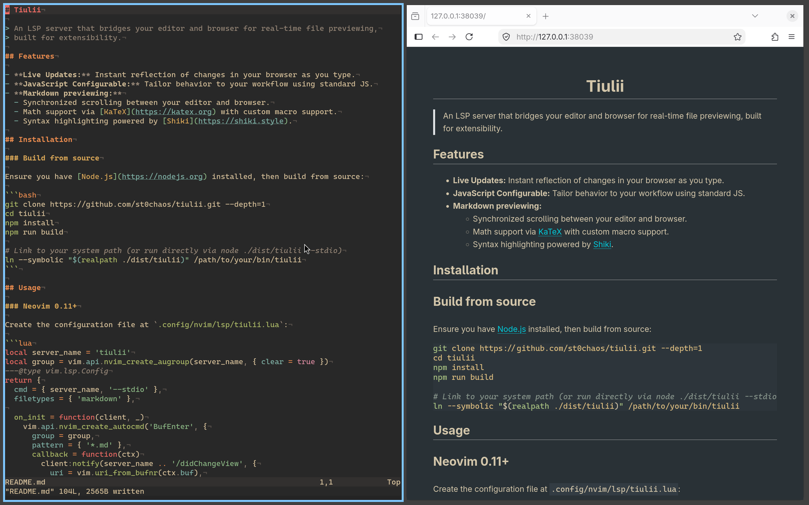

# Tiulii

> An LSP server that bridges your editor and browser for real-time file previewing,
> built for extensibility.



## Features

- **Live Updates:** Instant reflection of changes in your browser as you type.
- **JavaScript Configurable:** Tailor behavior to your workflow using standard JS.
- **Markdown previewing:**
  - Synchronized scrolling between your editor and browser.
  - Math support via [KaTeX](https://katex.org) with custom macro support.
  - Syntax highlighting powered by [Shiki](https://shiki.style).

## Installation

### Build from source

Ensure you have [Node.js](https://nodejs.org) installed, then build from source:

```bash
git clone https://github.com/st0chaos/tiulii.git --depth=1
cd tiulii
npm install
npm run build

# Link to your system path (or run directly via node ./dist/tiulii --stdio)
ln --symbolic "$(realpath ./dist/tiulii)" /path/to/your/bin/tiulii
```

## Usage

### Neovim 0.11+

Create the configuration file at `.config/nvim/lsp/tiulii.lua`:

```lua
local server_name = 'tiulii'
local group = vim.api.nvim_create_augroup(server_name, { clear = true })
---@type vim.lsp.Config
return {
  cmd = { server_name, '--stdio' },
  filetypes = { 'markdown' },

  on_init = function(client, _)
    vim.api.nvim_create_autocmd('BufEnter', {
      group = group,
      pattern = { '*.md' },
      callback = function(ctx)
        client:notify(server_name .. '/didChangeView', {
          uri = vim.uri_from_bufnr(ctx.buf),
        })
      end,
    })

    vim.api.nvim_create_autocmd('CursorHold', {
      group = group,
      pattern = { '*.md' },
      callback = function()
        client:notify(server_name .. '/didMoveCursor', {
          line = vim.fn.line('.') - 1,
        })
      end,
    })
  end,

  on_attach = function(client, bufnr)
    vim.keymap.set(
      'n',
      '<LocalLeader><LocalLeader>',
      function() client:notify(server_name .. '/openPreviewURL', {}) end,
      { buf = bufnr, desc = 'Live preview' }
    )
  end,

  on_exit = function() vim.api.nvim_clear_autocmds({ group = group }) end,
}
```

Then, enable the server in your init file:

```lua
vim.lsp.enable('tiulii')
```

## Configuration

Tiulii looks for a JavaScript configuration file with a default export at

- `$TIULII_HOME/config.js`
- `$XDG_CONFIG_NAME/tiulii/config.js`
- `~/.config/tiulii/config.js`
- `~/.tiulii/config.js`

For example,

```javascript
export default {
  port: 8000 // Port on which the HTTP server listens.
}
```

For more configuration options,
visit the [Documentation](https://st0chaos.github.io/tiulii).
