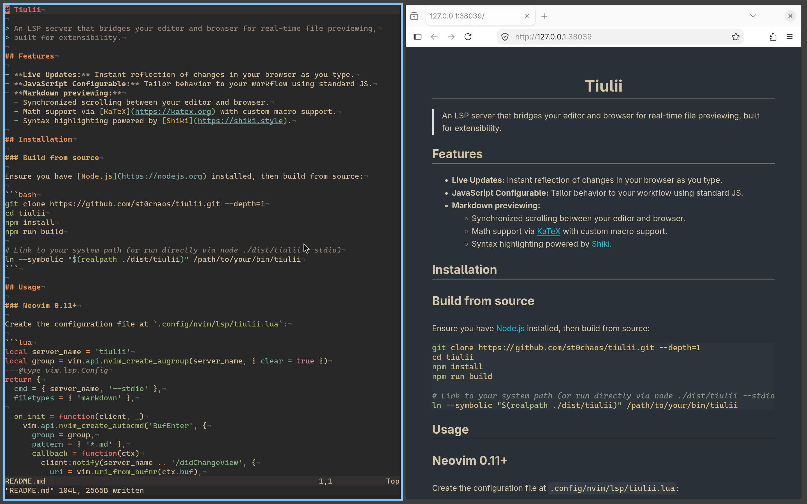

# tiulii

> An LSP server that bridges your editor and browser for real-time file previewing.



## Features

- Lively update changes in your browser as you type.
- Configurable using JavaScript.
- Preview Markdown:
  - Base on CommonMark with extensible supports for tables, strikethrough,
    front matter, and attributes.
  - Synchronized scrolling.
  - Math support via [KaTeX](https://katex.org) with custom macro support.
  - Syntax highlighting powered by [Shiki](https://shiki.style).
  - Mermaid support.

## Installation

### Install via Nix

```bash
nix shell github:st0chaos/tiulii
# Or
nix profile install github:st0chaos/tiulii
```

### Build from source

Ensure you have [Node.js](https://nodejs.org) installed, then build from source:

```bash
git clone https://github.com/st0chaos/tiulii.git --depth=1
cd tiulii
npm ci # or npm install
npm run build

# Link to your system path (or run directly via node ./dist/tiulii --stdio)
ln --symbolic "$(realpath ./src/server/dist/cli.js)" /path/to/your/bin/tiulii
```

## Usage

### Neovim 0.11+

Create the configuration file at `.config/nvim/lsp/tiulii.lua`:

```lua
local server_name = 'tiulii'
local group = vim.api.nvim_create_augroup(server_name, { clear = true })
---@type vim.lsp.Config
return {
  cmd = { server_name, '--stdio' },
  filetypes = { 'markdown' },

  on_init = function(client, _)
    vim.api.nvim_create_autocmd('BufEnter', {
      group = group,
      pattern = { '*.md' },
      callback = function(ctx)
        client:notify(server_name .. '/didChangeView', {
          uri = vim.uri_from_bufnr(ctx.buf),
        })
      end,
    })

    vim.api.nvim_create_autocmd('CursorHold', {
      group = group,
      pattern = { '*.md' },
      callback = function()
        client:notify(server_name .. '/didMoveCursor', {
          line = vim.fn.line('.') - 1,
        })
      end,
    })
  end,

  on_attach = function(client, bufnr)
    -- Use your preferred key here.
    vim.keymap.set(
      'n',
      '<LocalLeader><LocalLeader>',
      function() client:notify(server_name .. '/openPreviewURL', {}) end,
      { buf = bufnr, desc = 'Live preview' }
    )
  end,

  on_exit = function() vim.api.nvim_clear_autocmds({ group = group }) end,
}
```

Then, enable the server in your init file:

```lua
vim.lsp.enable('tiulii')
```

### Emacs (Eglot)

Add the following code to your `user-lisp-directory` or your init file.

```elisp
(defvar tiulii-preview-key "C-c p"
  "Key to start a preview page.")
(defvar tiulii-idle-time 0.5
  "Time interval of sending the line number where the cursor is located.")
(defvar-local tiulii--flag nil)
(defvar tiulii--buffer-count 0)
(defvar tiulii--timer nil)

(defun tiulii--managed-p ()
  (member "tiulii" (process-command (jsonrpc--process (eglot-current-server)))))

(defun tiulii--on-window-buffer-change (_frame)
  (let ((buffer (current-buffer))
        (file-name (buffer-file-name)))
    (when (and buffer file-name tiulii--flag)
      (jsonrpc-notify (eglot-current-server) :tiulii/didChangeView
                      `(:uri ,(eglot-path-to-uri file-name))))))

(defun tiulii--on-idle-timeout ()
  (let ((buffer (current-buffer))
        (file-name (buffer-file-name)))
    (when (and buffer file-name tiulii--flag)
      (jsonrpc-notify (eglot-current-server) :tiulii/didMoveCursor
                      (list :line (1- (line-number-at-pos nil t))
                            :uri (eglot-path-to-uri file-name))))))

(defun tiulii--preview ()
  (interactive)
  (jsonrpc-notify (eglot-current-server) :tiulii/openPreviewURL nil))

(with-eval-after-load 'eglot
  (add-hook 'eglot-managed-mode-hook
            (lambda ()
              (if (eglot-managed-p)
                  (when (tiulii--managed-p)
                    (setq-local tiulii--flag t)
                    (cl-incf tiulii--buffer-count)
                    (keymap-local-set tiulii-preview-key #'tiulii--preview)
                    (when (= 1 tiulii--buffer-count)
                      (add-hook 'window-buffer-change-functions
                                #'tiulii--on-window-buffer-change)
                      (setq tiulii--timer
                            (run-with-idle-timer
                             tiulii-idle-time t #'tiulii--on-idle-timeout))))
                (setq-local tiulii--flag nil)
                (cl-decf tiulii--buffer-count)
                (keymap-local-unset tiulii-preview-key)
                (when (= 0 tiulii--buffer-count)
                  (remove-hook 'window-buffer-change-functions
                               #'tiulii--on-window-buffer-change)
                  (setq tiulii--timer nil))))))

(with-eval-after-load 'eglot
  (add-to-list 'eglot-server-programs '(markdown-mode . ("tiulii" "--stdio"))))
```

## Configuration

Tiulii looks for a JavaScript configuration file with a default export at

- `$TIULII_HOME/config.js`
- `$XDG_CONFIG_NAME/tiulii/config.js`
- `~/.config/tiulii/config.js`
- `~/.tiulii/config.js`

For example,

```javascript
export default {
  port: 8000, // Port on which the HTTP server listens.
  style: "./style.css",
}
```

For more configuration options,
visit the [Documentation](https://st0chaos.github.io/tiulii).

### Style example

Here is my personal `style.css`.

```css
:root {
    --background: #ffffff;
    --surface: #f8f9fa;
    --border: #e9ecef;
    --text-primary: #212529;
    color-scheme: light;
}
@media (prefers-color-scheme: dark) {
    :root {
        --background: #293136;
        --surface: #333c43;
        --border: #5d6b66;
        --text-primary: #d3c6aa;
        color-scheme: dark;
    }
}
*,
*::before,
*::after {
    box-sizing: border-box;
    transition:
        background-color 0.3s ease,
        border-color 0.3s ease,
        color 0.3s ease;
}
body {
    background-color: var(--background);
    color: var(--text-primary);
    font-family: serif;
    padding: 2rem;
    font-size: 19px;
    line-height: 1.6;
    max-width: 80ch;
    margin: 0 auto;
    text-wrap: pretty;
    text-align: justify;
    hyphens: auto;
    hanging-punctuation: allow-end last;
}
h1 {
    font-size: 2rem;
    border-bottom: 1px solid var(--border);
    text-align: center;
}
h2 {
    font-size: 1.5rem;
    border-bottom: 1px solid var(--border);
}
h3 {
    font-size: 1.5rem;
}
h4 {
    font-size: 1rem;
}
blockquote {
    margin: 0 0 1rem 0;
    padding: 0 1rem;
    border-left: 0.25rem solid var(--border);
}
code {
    font-family: ui-monospace, monospace;
}
code:not(pre code) {
    padding: 0.2em 0.2em;
    background-color: var(--surface);
}
pre {
    overflow: auto;
    line-height: 1.2;
}
table {
    border-collapse: collapse;
    width: 100%;
    margin-bottom: 1rem;
}
th,
td {
    padding: 0.5rem 1rem;
    border: 1px solid var(--border);
}
img {
    max-width: 100%;
    height: auto;
}
```
